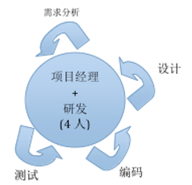
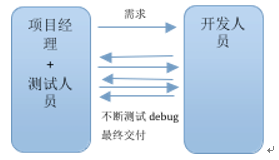
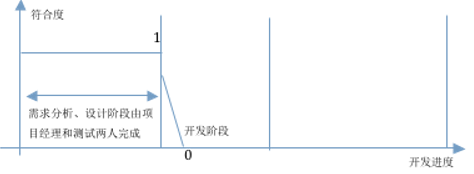

# 对公司开发模型的思考

> 2014年07月31日 写于 福州

## 0x00 前言

工作了三年多，经历了公司的开发模型从摸着石头过河到现在走入弯路的转变，写篇文章总结一下这些思路，其中不少值得我们警惕。

## 0x01 成立之初的开发模型 - 没有模型

团队组成：一个项目经理和三个开发人员，项目经理有时写要代码。
团队协作方式：此阶段我们每个人都是全栈的，除了项目管理的工作由经理安排外，剩下所有事情（从PS到需求讨论、设计再到开发测试和最后结果）都是我们4个人一起完成。

### 分析

*说明：我用 "各阶段对需求的理解程度与最初的期望值的符合度" 来衡量一下我们团队的工作效率 (符合度 = 各阶段对需求的理解程度 / 最初的期望值, 最大值为1表示完全符合期望，0表示与预期背道而驰了）。*

这个阶段随着开发进度的增加符合度的变化应该如下图所示：

1. 因为需求分析、设计设计都是我们一起讨论的，所以我们每个人都知道开发完成后会是什么样子，当开发编码的时候我们的心中都知道最终的结果需要怎样。也就是说我们每个人都能够充分的理解需求。
2. 开发过程中难免会遇到各种未知的因素（比如：各种bug，某些功能实现比较困难采用了其他的方法等），这些因素也是避免不了的，导致最终的结果和预期的会有差距，这里降到了0.7。再经过后期的几轮调式、测试、修改、回归测试完成最终的结果，即又回到了1
这种模式的优点：每个人都可以以主人翁的情怀参与讨论，每个人都有权利和义务为完成最终的目标而争吵不休。

### 缺点

这个模型恐怕只适合我们这样的小团队了，如果人数多了，采用这样的方法确实比较浪费时间和降低工作效率。

## 0x02 现阶段的开发模型 - 需求分析、设计与开发人员分离

我们改变开发模型的初衷是觉得开发人员需要参与软件工程的各个方面，这样精力太分散了，不利于开发技术的提高。另外由于经理是搞测试出身的对测试环节看得比较重，所以单独招聘了两个测试工程师。经过一段时间的调整，演变成现在的开发模型

### 团队组成

一个项目经理、两个测试人员（手工测试，不懂代码），三个开发人员。

### 团队协作方式

由项目经理带领两个测试人员分析需求、完成产品设计草图，然后将开发任务细分成可以一两天完成的任务下发给开发人员。开发人员完成开发后将程序交给测试人员测试，并经过几轮的bug修改、回归测试，形成最终的产品。

### 分析

现在随着开发进度的增加符合度的变化变成了下图所示的样子

1. 和之前的变化是需求分析、设计阶段开发人员不再参与了。因为这一点导致了开发人员理解的需求会和前一个阶段设计的存在偏差，在开发的阶段刚开始的时候就偏离了预期30%。加上各种bug导致的0.2的差别，当开发完成时可能只有期望值的一半了。接下来就要在测试阶段花费更多的时间对需求偏差的地方进行修正、编码、测试，反复如此才能达到期望中的1.
2. 如果比较聪明的开发人员可以做到如下图所示的曲线，在开发的初期先花时间将需求理解清楚。

但是有的程序员可能并不了解需求，甚至有理解错误的可能：

因为这种模型里，开发人员没有参与需求的讨论导致开发人员到底对需求了理解了多少是个未知数，全靠开发人员自己的悟性了。另外测试人员也是没有经验的应届生，经常测试人员分析的需求就发生了偏离，就更别说后续的工作了。

## 0x03 我的结论

我们目前采用的开发模型并不适合我们的现状，其原因如下：

1. 我认为采用这种模型的前提是认为开发任务中不会遇到技术难点，开发时间是可以预测的。事实上评估任务开发需要的时间并没有开发人员参与。

2. 因为经理是搞测试出身的所以特地招聘了两名测试人员，使得我们团队开发人员和非开发人员的比例是1：1，这在一个之后6个人的团队里确实不太合适。其实把开发人员培养出有良好的测试思路一样可以达到同等的效果，而且还会写代码，还可以分担部分开发的任务。

3. 这样发展下去有一种隐患，那就是经理、测试人员和开发人员之间形成了两派。并且导致测试人员将来在公司的发展空间更大，开发人员的地位比较低，属于随时可以替换的岗位。这让我想起了项目外包公司的特征：

4. 另外再来看一下截止到当前的团队成员的情况：两个测试人员（1年工作经验），三个开发人员（三年工作经验）。启用经验不足的员工来完成难度比较大的需求分析和产品设计工作，而经验还算丰富的开发人员却没有得到合理的使用。

## 0x04 感慨

1. 当人们对眼前的问题感到束手无策的时候总会把以前的工作经验使用起来，尽管这些经验已经不适合现状。
2. 一个团队的发展跟Team Lead的决策有直接的关系，好的决策能够让团队每一个人受益，不好的决策则会把团队推向不归路。
