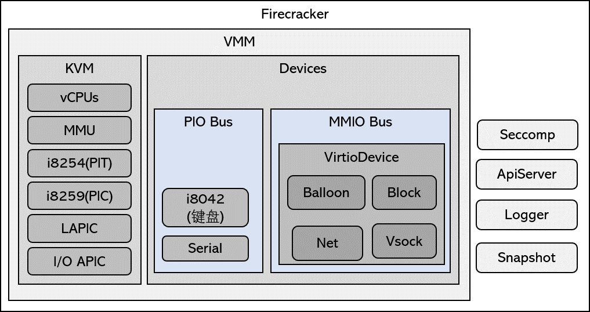

# Firecracker

Firecracker（[官网](https://firecracker-microvm.github.io/)，[Github](https://github.com/firecracker-microvm/firecracker)）是基于Chrome OS中的CrosVM（[官网](https://chromium.googlesource.com/chromiumos/platform/crosvm/)）开发的，crosvm是一个完整的虚拟机，Firecracker对他做减法，仅仅保留了最基本的功能，亚马逊称之为microVM。

它没有BIOS或UEFI，也没有PCI总线，只有最基本的Port I/0设备(键盘、窗口、RTC)和基于MMIO的Virtio设备，也不支持设备的热拔插。

## 架构

先看官网文档：https://github.com/firecracker-microvm/firecracker/blob/master/docs/design.md



## 如何使用

先看这里：https://github.com/firecracker-microvm/firecracker/blob/master/docs/rootfs-and-kernel-setup.md

1. 下载Firecracker二进制程序, https://github.com/firecracker-microvm/firecracker/releases

2. 下载hello内核镜像和Rootfs, **x86_64版本：**[kernel](https://s3.amazonaws.com/spec.ccfc.min/img/hello/kernel/hello-vmlinux.bin) 和 [rootfs](https://s3.amazonaws.com/spec.ccfc.min/img/hello/fsfiles/hello-rootfs.ext4).  **aarch64版本**：[kernel](https://s3.amazonaws.com/spec.ccfc.min/img/aarch64/ubuntu_with_ssh/kernel/vmlinux.bin) 和 [rootfs](https://s3.amazonaws.com/spec.ccfc.min/img/aarch64/ubuntu_with_ssh/fsfiles/xenial.rootfs.ext4).

3. 创建虚拟机配置文件`hello.json`,(该里面路径为实际路径)

```json
{
    "machine-config": {
        "vcpu_count": 2,
        "mem_size_mib": 512
    },
    "boot-source": {
        "kernel_image_path": "/home/xrw/App/firecracker/hello/hello-vmlinux.bin",
        "boot_args": "console=ttyS0 reboot=k panic=1 pci=off"
    },
    "drives": [
        {
            "drive_id": "rootfs",
            "path_on_host": "/home/xrw/App/firecracker/hello/hello-rootfs.ext4",
            "is_root_device": true,
            "is_read_only": false
        }
    ],
    "network-interfaces": []
}
```

4. 启动机器

```sh
# 设置/dev/kvm权限(当前非root)
sudo setfacl -m u:${USER}:rw /dev/kvm
# 启动
rm -rf /tmp/firecracker.socket
./firecracker --api-sock /tmp/firecracker.socket --config-file ./hello/hello.json
```

5. 登录账号：`root`，密码：`root`.

## 线程模型

以下是启动一个双核vCPU的线程情况：

- `fircracker`：主线程，创建虚拟机，并处理epoll事件循环(`EventManager`)。

- `fc_api`：API服务线程，用来接收外部的各种操作(`ApiServerAdapter`)。
- `fc_vcpu %d`：每个线程执行一个vCPU。

```
PID USER PR NI   VIRT   RES  SHR S %CPU %MEM   TIME+ COMMAND
220 xrw  20  0 535708 55056 4016 S  0.0  0.7 1:38.21 firecracker
221 xrw  20  0 535708 55056 4016 S  0.0  0.7 1:38.21 fc_api
224 xrw  20  0 535708 55056 4016 S  0.0  0.7 1:38.21 fc_vcpu 0
225 xrw  20  0 535708 55056 4016 S  0.0  0.7 1:38.21 fc_vcpu 1
```

## 源代码

```yaml
- src
	# 主进程
    - firecracker  # 虚拟机主进程
    - jailer       # 用来限制主进程权限的启动程序

    # 一些杂项
    - api_server # api服务
    - dumbo      # HTTP/TCP/IPv4协议栈，网卡设备用得到
    - micro_http # HTTP协议解析
    - logger     # 日志输出和统计信息(metrics) 
    - polly      # epoll的封装
    - mmds       # Microvm Metadata Service

    # 虚拟机相关
    - arch       # CPU架构相关数据结构
    - cpuid      # 处理Gust的CPUID信息
    - kernel     # 加载Linux内核到Guest内存
    - rate_limiter # 流控算法，网卡用的
    - seccomp    # seccomp封装
    - snapshot   # VM快照功能
    - vmm        # VMM的代码
    - devices    # 虚拟设备
```

## 参考文章

- [Making OSv Run on Firecracker - OSv Blog](http://blog.osv.io/blog/2019/04/19/making-OSv-run-on-firecraker/)
- [Firecracker – Lightweight Virtualization for Serverless Computing | AWS News Blog (amazon.com)](https://aws.amazon.com/cn/blogs/aws/firecracker-lightweight-virtualization-for-serverless-computing/)
- https://github.com/firecracker-microvm/firecracker/tree/master/docs
- https://rootw.github.io/2019/08/firecracker-all/

