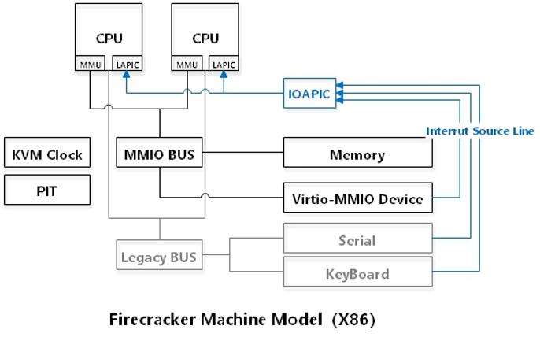
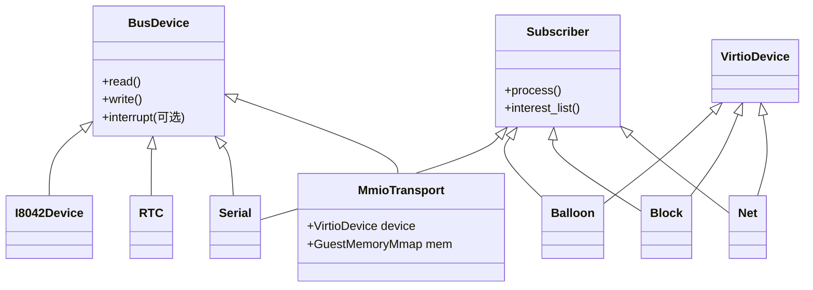
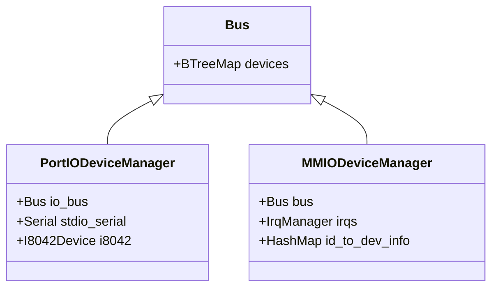

## 虚拟设备列表

KVM自带了内存管理模块，中断控制器、时钟。

Firecracker模拟的设备

- Port I/O设备
    - 键盘
    - 串口
- MMIO设备
    - Virtio（block、net、ballon、vsock）
    - BootTimer（启动时间记录器）



## 设备模型

- `trait BusDevice`：是所有设备的接口，所有设备都实现了BusDevice接口，然后注册到Bus上。



- `struct Bus`：模拟电脑Bus的概念，管理所有设备的中断处理和读写操作，创建了两个Bus，一个用来管理Pot I/O设备的`struct PortIODeviceManager`，另一个用来管理MMIO设备的`struct MMIODeviceManager`。




## PIO设备

创建PIO设备步骤：

1. 定义虚拟设备数据结构
2. 实现BusDevice接口，用来和Guest驱动交互
3. 实现Subscriber接口，用来和真实世界交互

初始化PIO设备步骤：

1. 实例化设备对象
2. 注册到PIO Bus（PortIODeviceManager）
3. 注册Guest的IRQ到一个eventfd，用来通知IRQ请求。

**Firecracker实现的PIO和IRQ表：**

| 设备      | IO地址 | 长度 | IRQ  | 说明                      |
| --------- | ------ | ---- | ---- | ------------------------- |
| COM1      | 0x3f8  | 8    | 4    | 连接到Host的stdin和stdout |
| COM2      | 0x2f8  | 8    | 3    | 空设备                    |
| COM3      | 0x3e8  | 8    | 4    | 空设备                    |
| COM4      | 0x2e8  | 8    | 3    | 空设备                    |
| i8042键盘 | 0x060  | 5    | 1    |                           |
| PIT       |        |      | 0    | KVM自带的时钟源           |


### Serial设备

以Serial设备为例，说明PIO设备的定义和初始化。

**定义虚拟设备：**

```rust
// src/device/src/legacy/serial.rs

// 1. 定义设备对象
pub struct Serial {
    // 虚拟设备数据结构
    interrupt_evt: EventFd, // Guest世界IRQ通知绑定的EventFd, 向它写数据相当于向Guest提交IRQ请求
    ...
    
   	// 绑定真实设备的数据结构
    in_buffer: VecDeque<u8>,  // 真实设备上读到的数据Buffer
    out: Option<Box<dyn io::Write + Send>>, // 真实设备输出源
    input: Option<Box<dyn ReadableFd + Send>>, // 真实设备输入源
    buffer_ready_evt: Option<EventFd>, // 表示in_buffer等着从input获取数据
}

impl Serial {
    // 处理Guest驱动的读请求
    fn handle_read(&mut self, offset: u8) -> u8 {    
        // 读真实设备上获取的in_buffer内容，传递给虚拟设备。
        let byte = self.in_buffer.pop_front().unwrap_or_default();

        if self.in_buffer.is_empty() {
            // in_buffer为空，激活真实设备的buffer_ready_evt事件，随时获取真实数据
            self.signal_buffer_ready(); 
        }

        byte
	}
	
    // 处理Guest驱动的写请求
	fn handle_write(&mut self, offset: u8, value: u8) -> io::Result<()> {
		// 将数据写到绑定的真实设备out
        out.write_all(&[value])?;
        out.flush()?;
	}
    
    // 虚拟设备的各种操作
    ...

}

// 2. 实现BusDevice接口，和Guest驱动交互的部分
impl BusDevice for Serial {
    // 处理Guest驱动的read请求
    fn read(&mut self, offset: u64, data: &mut [u8]) {
        data[0] = self.handle_read(offset as u8); 
    }
    
    // 处理Guest驱动的write请求
    fn write(&mut self, offset: u64, data: &[u8]) {
        self.handle_write(offset as u8, data[0]);
    }
}

// 3. 实现Subscriber接口,和现实设备交互的部分
impl Subscriber for Serial {}
```

**创建初始化设备：**

```rust
// src/vmm/src/builder.rs

setup_serial_device()
	// 1. 真实设备READ的EventFd
	-> intr_evt = EventFd::new()

	// 2. 虚拟设备实例
	-> let mut serial = Serial::new_in_out(interrupt_evt,
    		Box::new(io::stdin()),   // input绑定真实世界的stdin
            Box::new(io::stdout())); // out绑定真实世界的stdout

    // 注册真实输入源io::stdin的IN监听事件
    -> event_manager.add_subscriber(serial);

create_pio_dev_manager_with_legacy_devices
	// src/vmm/src/device_manager/legacy.rs
	->  pio_dev_mgr.register_devices
    	// 3. 注册虚拟设备到PIO Bus上
    	-> PortIODeviceManager.io_bus.insert(serial);

    	// 4. Guest世界IRQ和EventFd
    	-> vm_fd.register_irqfd(&interrupt_evt, 4);
```

## MMIO设备

MMIO的Guest物理地址范围是`0xd0000000`到`0xffffffff`。

创建MMIO虚拟设备步骤：

1. 定义虚拟设备数据结构
2. 实现BusDevice接口，用来和Guest驱动交互
3. 实现Subscriber接口，用来和真实世界交互

初始化MMIO设备步骤：

1. 实例化设备对象
2. 实例化一个MMIODeviceInfo，它管理虚拟设备的MMIO地址和IRQ
3. 注册虚拟设备到MMIO Bus（MMIODeviceManager）
4. 加入到MMIO虚拟设备ID管理节点上。

以下是BootTimer伪设备的代码：

```rust
// 定义设备见：src/devices/src/pseudo/boot_timer.rs

// 创建并注册设备：src/vmm/src/builder.rs
attach_boot_timer_device
	-> BootTimer::new() // 实例化虚拟设备
	-> register_mmio_boot_timer()
		-> slot = self.allocate_new_slot(0) // 实例化MMIODeviceInfo
		-> register_mmio_device();
			-> bus.insert()            // 注册到MMIO Bus上
			-> id_to_dev_info.insert() // 加入ID管理节点
```

## Virtio设备

- 定义和创建Virtio设备和上面MMIO差不多，不同的是需要实现VirtioDevice接口，它遵守Virtio协议规范。
- Virtioqueue的拥有者是Guest的驱动，后端设备是使用者，使用的地址都是GPA。
- Firecarcker实现的是基于MMIO而不是PCI，所以Linux不会自动发现Virtio设备，只能静态发现，方法是在cmdline指定virtio设备参数，参数格式：`virtio_mmio.device=4K@0xd0000000:5`，表示mmio物理地址是0xd0000000，长度为4K，irq为5。

注册virtio设备略有不同：

```c
// src/vmm/src/device_manager/mmio.rs
// 区别于register_mmio_device

register_mmio_virtio_for_boot
    -> register_mmio_virtio
        // 绑定每个Query的EventFd到MMIO地址，i是队列索引
    	// 偏移+0x50(QueueNotify)用来驱动通知设备有数据了
        -> for (i, queue_evt) in queue_events()
            -> vm.register_ioevent(queue_evt, io_addr + 0x50, i)
        // 绑定Guest世界的IRQ到EventFd
        -> vm.register_irqfd(interrupt_evt(), slot.irqs[0])
        // 注册通用mmio设备的流程
        -> register_mmio_device()
    
    // 追加设备信息"virtio_mmio.device"到cmdline中
	-> add_virtio_device_to_cmdline
```

- `vm.register_ioevent`: 对`ioctl(KVM_IOEVENTFD)`的封装，他的作用是关联Guest的I/O地址到eventfd，当驱动向I/O地址write时激活eventfd。**他的好处是**内核里面直接完成了IO事件通知，节省了Host内核与应用层的上下文切换。
  
     - 正常的IO写操作： 
     ```
     Guest写io地址 -> VMX exit -> KVM exit -> 虚拟设备操作(应用层) -> KVM enter -> VMX enter
     ```
     - 使用`KVM_IOEVENTFD`后：
     ```
     Guest写io地址 -> VMX exit -> KVM通知eventfd -> VMX enter 
     ```